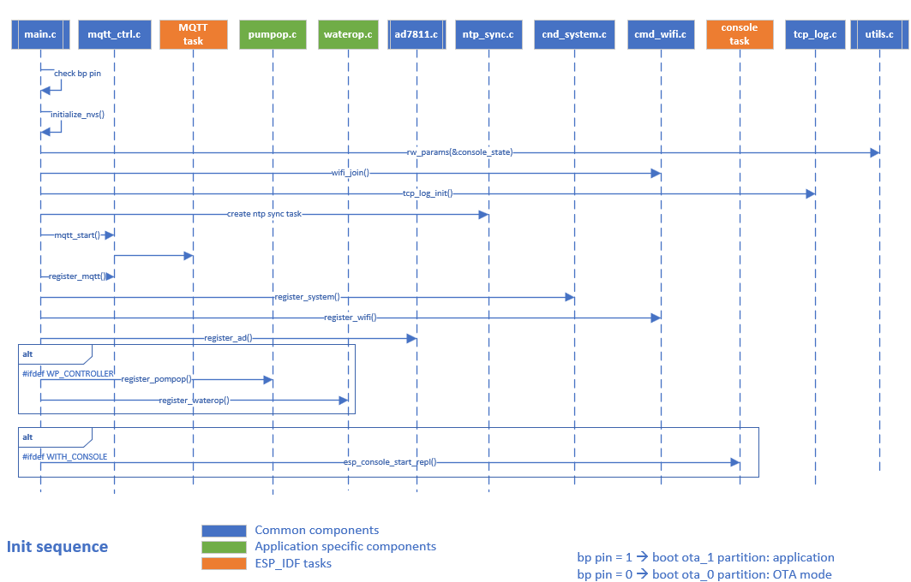

# esp32wp_controller
Irrigation controller.
It's a rework of generic esp32_controller dedicated to a small irrigation automation. It controls a water pump and 2 tap actuators for each irrigation zone.

## Introduction
It follows the same approach like [esp32_controller](https://github.com/ves011/esp32_controller). 
This implementation uses an old [ESP32 dev board using ESP32WROOM32](https://docs.espressif.com/projects/esp-idf/en/latest/esp32/hw-reference/esp32/get-started-devkitc.html). 
In addition, because the poor performance of internal ADC it uses an external [AD7811](https://www.analog.com/en/products/ad7811.html) connected over SPI.  

## How it works

>**Water program operation** 
>>The parameters for water program are stored in dv_program.txt file located in user partition on the ESP32 flash.
Each irrigation interval is defined by an entry in the file and has 7 fields:  
>>>**zone no, start H, start min, stop H, stop min, completion status, fault** 

>>with H (hour) in 24H format 
Completion status can be: NOT_STARTED, IN_PROGRESS, START_ERROR, STOP_ERROR, or ABORTED. 
>>>NOT_STARTED - is the state of program after reset status; only programs in NO_STARTED state can be started 
IN_PROGRESS - is the state of a program after started succesfully 
SATRT_ERROR - if start_watering function is not successful the program enter START_ERROR state; fault field provides the reason for failure 
STOP_ERROR - if stop_watering function is not successful the program enter STOP_ERROR state; fault field provides the reason for failure 
ABORTED - if the program is aborted by user 

>>Completion status is reset to NOT_STARTED once per day at RESET_PROGRAM_H:RESET_PROGRAM_M time. 
**fault** field contains the error numerical value 
>>In my case, because the limited water pressure provided by pump, the logic allows only single zone irrigation at given point in time.  
When actual time gets equal or higher than specified start time of some zone and completion status is NOT_STARTED, start the program by: 
>>>ensure all the water taps are closed 
start water pump 
wait water pressure to be over max pressure limit 
>>>>if water pressure too low: stop water pump, abort program and return error 

>>>open tap for the zone 
check if water pressure is between limits 
>>>>if water pressure not between limits: stop water pump, close the tap, abort program and return error 

>>>set completion status "in progress" 
>>If start programs returns error, updates completion status to ABORTED or START_ERROR, else its set to IN_PROGRESS. 
writes program status in "program_status.txt"

